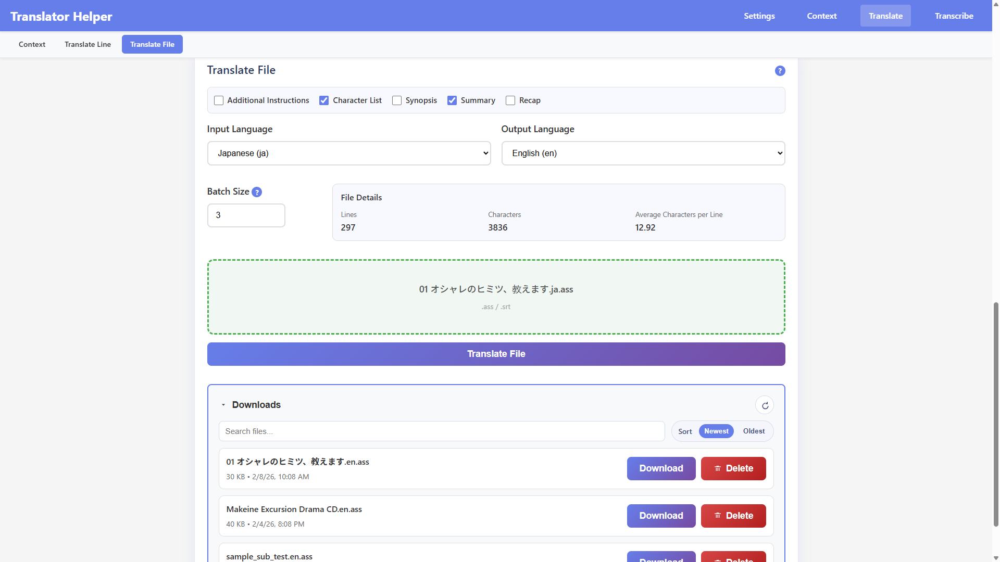
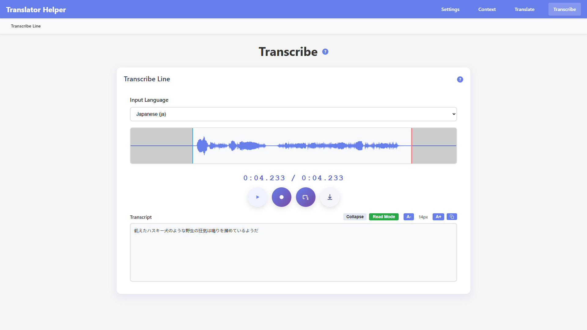

# Translator Helper

A full-stack web application for transcribing and translating subtitle files. Built with Angular 17 (frontend) and FastAPI (backend), featuring WhisperX transcription and Claude/OpenAI or local llama.cpp-based translation.

## Screenshots

 

## Features

### Settings Page
- **Status**: Monitor model readiness (LLM, WhisperX)
- **WhisperX Settings**: Select model size, compute device (CPU/CUDA), compute type, and batch size; load model into memory
- **LLM Settings**: Configure the active LLM backend, including Claude/OpenAI API settings or llama.cpp GGUF settings for local inference

### Context Page
- **File Download/Upload**: Import/export context as JSON files, upload subtitle files for processing
- **Character List**: Auto-generate character names and descriptions from subtitle files
- **Synopsis**: Generate episode or scene synopsis (optional: include character list)
- **Summary**: Generate high-level summary (optional: include character list)
- **Recap**: Generate comprehensive recap from multiple context JSON files for multi-episode continuity

### Transcribe Page
- **Transcribe Line**: Record audio from microphone with waveform visualization, transcribe to text using WhisperX
- **Transcribe File**: Upload an audio file and generate a timed .ass subtitle file using WhisperX (note: timings are not accurate enough to be reliable)

### Translate Page
- **Context**: View and edit saved context (character list, synopsis, summary, recap)
- **Translate Line**: Translate single lines with selectable context sources (character list, synopsis, summary)
- **Translate File**: Upload subtitle files (.ass/.srt) with batch size support; translated files are saved in `backend/outputs/sub-files/` for download


## Dependencies

### Backend
- Python 3.10+
- [uv](https://docs.astral.sh/uv/) for fast Python package management
- [FastAPI](https://fastapi.tiangolo.com/) for REST API server
- [LangChain](https://www.langchain.com/) for LLM orchestration
- [PyTorch](https://pytorch.org/get-started/locally/) for GPU acceleration (I used CUDA 12.8)
- [WhisperX](https://github.com/m-bain/whisperX) for audio transcription with accurate word-level timestamps
- [Anthropic Claude API](https://www.anthropic.com/) for translation and context generation
- [OpenAI API](https://platform.openai.com/) for translation and context generation
- [llama.cpp](https://github.com/ggml-org/llama.cpp) via `llama-cpp-python` for local GGUF inference
- `pysubs2` for subtitle file parsing (.ass/.srt)

### Frontend
- [Node.js](https://nodejs.org/) 18+ and npm
- [Angular](https://angular.io/) 17.3.12 standalone components

## Setting Up the Backend and Frontend

### 1. Clone the Repository

```bash
git clone https://github.com/dragonstonehafiz/translator-helper.git
cd translator-helper
```

### 2. Creating A Virtual Environment

```bash
cd backend
uv venv
.venv\scripts\activate
uv pip install -r requirements.txt
```

### 3. Installing PyTorch with CUDA (Optional/For Hardware Acceleration)

You can skip this section if you have no intention of using **hardware acceleration during transcription or local llama.cpp inference**. Before doing anything, you will need to install the [CUDA toolkit](https://developer.nvidia.com/cuda-downloads). If you are on windows, you will need to install [Microsoft Visual Studio 2022](https://aka.ms/vs/17/release/vs_community.exe) before doing that.

If you intend on using hardware acceleration please take note of which PyTorch versions works with your GPU. For example, 50 Series GPUs do not work with older PyTorch versions.

All commands that you need to run to install PyTorch with CUDA can be found [here](https://pytorch.org/get-started/locally/). If you need to install older PyTorch versions, check [here](https://pytorch.org/get-started/previous-versions/). Below will be the command I personally used.

```bash
uv pip uninstall torch
uv pip install torch --index-url https://download.pytorch.org/whl/cu128
```

### 4. Installing Torchaudio

Once you have installed pytorch with CUDA, you will need to reinstall torchaudio so that it matches your torch version.

```bash
uv pip uninstall torchaudio
uv pip install torchaudio
```

### 5. Configuration

Settings (API keys, model names, temperatures, etc.) are stored as JSON files in `backend/data/`. These files are created automatically with default values the first time the backend starts up. You can set your API keys and preferences through the **Settings page** in the app — changes are saved immediately to the corresponding JSON file.

| File | Provider |
|---|---|
| `backend/data/llm_claude.json` | Anthropic Claude |
| `backend/data/llm_chatgpt.json` | OpenAI ChatGPT |
| `backend/data/llm_llamacpp.json` | llama.cpp (local GGUF) |
| `backend/data/audio_whisperx.json` | WhisperX |
| `backend/data/audio_whisper.json` | Whisper |

### 6. Using llama.cpp (Local LLM)

If you want to use a local GGUF model instead of an API-based LLM, install the llama.cpp dependency and place your model file:

1. **Install llama.cpp dependency**
   ```bash
   uv pip install llama-cpp-python
   ```

2. **Place your GGUF model file**
   - Put the model in `backend/model-files/`

3. **Start the backend**
   - The backend reads local llama.cpp settings from `backend/data/llm_llamacpp.json`
   - If the file does not exist yet, it will be created automatically

4. **Configure the model through the Settings page**
   - Select the GGUF file from `backend/model-files/`
   - Adjust:
     - `model_file`
     - `n_ctx`
     - `n_gpu_layers`
     - `n_threads`
     - `temperature`

Notes:
- The local llama.cpp implementation lives in `backend/models/llm_llamacpp.py`
- The current backend `ModelManager` already supports `LLMLlamaCpp`; no manual code edits are required just to use the local backend
- API-based backends remain available through their own JSON config files in `backend/data/`
- `n_gpu_layers = -1` lets llama.cpp auto-select GPU offload depth

### 7. Setting up the Frontend

```bash
cd ..
cd frontend
npm install
```

## Using the App

### 1. Start the Backend Server

From the root directory of this project.

```bash
cd backend
.venv\scripts\activate
python server.py
```

If there are no issues, you should see this:

```bash
INFO:     Started server process [24084]
INFO:     Waiting for application startup.
INFO:     Application startup complete.
INFO:     Uvicorn running on http://0.0.0.0:8000 (Press CTRL+C to quit)
```

This means the server has started up successfully.

### 2. Start the Frontend

```bash
cd ..
cd frontend
npm run start
```

If the frontend starts successfully, you should see this:

```bash
Watch mode enabled. Watching for file changes...
  ➜  Local:   http://localhost:4200/
  ➜  press h + enter to show help
```

### 3. Access the App

Once the two previous steps are completed, you can access the app by going to http://localhost:4200/.

## TODO

- Normalize backend error formats everywhere so the frontend can rely on one consistent error shape when rendering failures.
- Add a translation review task where users upload an original subtitle file and a translated subtitle file, and the app reports issues and unnatural-sounding sections.
- Add shared subtitle file state for translation/context workflows so users do not need to upload the same file separately on each page.
- Re-evaluate recap generation usefulness and quality, since the current flow exists but has not been validated much in real use.
- Fix the Context page download action so it actually downloads the selected context file instead of only loading it into the page.
- Add a way to choose a specific model per translate/context task instead of forcing all tasks to use the same globally loaded LLM.
